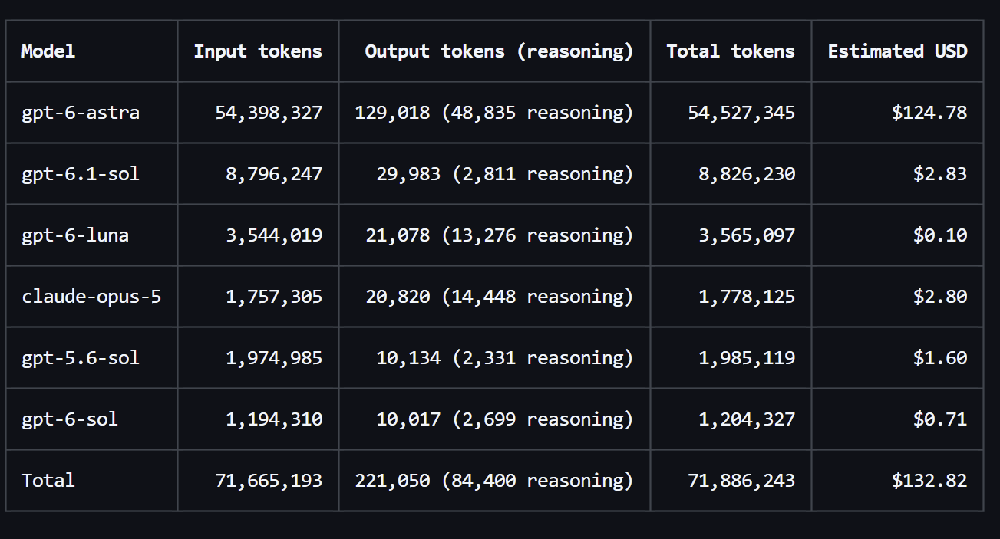
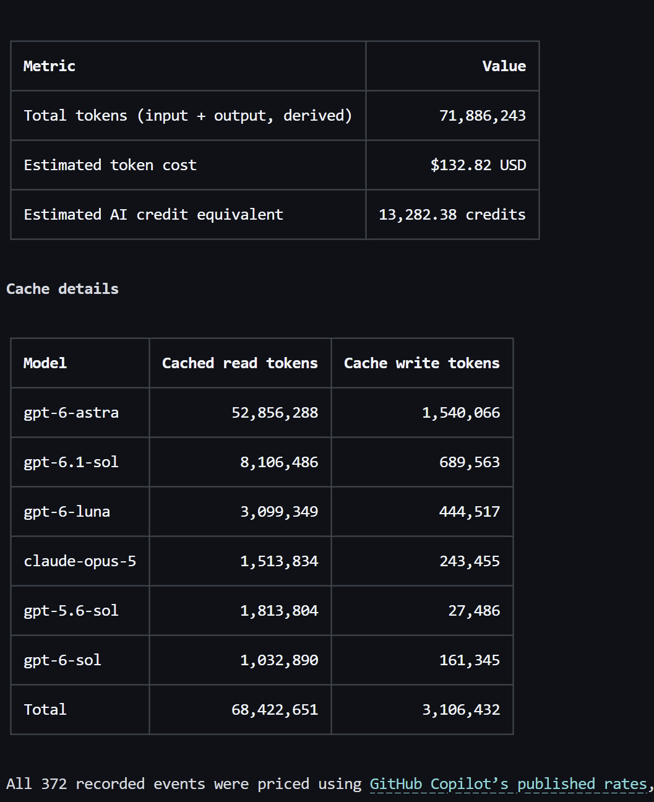

# Personalized Copilot Usage

A reusable Copilot skill for understanding **your own recorded model activity**
and, separately, your **GitHub current-cycle credit consumption**.

No Copilot CLI installation or organization billing administrator role is
required. This is an instruction-based skill, not an independent dashboard,
extension, or universal telemetry collector.

## Example report

**Models, tokens, and estimated cost**



**Summary and cache details**



User-contributed examples of the default local report, not live data.
Reasoning stays beside output tokens; cached reads and writes appear in a
separate details table. These estimates cover recorded local activity and
are not actual billed charges.

## What it can report

| Source | Reports | Requirements |
|---|---|---|
| Local app history | Models, tokens, estimated per-model USD and credit equivalents, daily trends | Personal `session_store_sql` tool, verified GitHub Copilot model rates, and Python 3.9+ for the offline calculator |
| Copilot settings | Current-cycle credits, displayed limit and reset date when visible | Browser automation tool with the user's authenticated GitHub session |
| Personal billing API, optional | Billing quantities and model aggregates for personally purchased plans | Python 3.9+ and existing authorized GitHub authentication |

**Installing the skill does not add these tools.** The local-history integration
is host-specific: ordinary IDE Copilot installations may not expose
`session_store_sql`. Browser sign-in is independent of editor sign-in.
If a source is unavailable, the skill explains the limitation instead of
inventing metrics.

Local records do not cover all devices, IDEs, or GitHub products. Local model
identifiers may differ from billing model labels. Recorded API events are not
premium requests or AI credits. Estimated credit equivalents are clearly
separate from measured account credit consumption.

For organization-managed Business/Enterprise users, the skill uses their own
**Copilot settings > Usage this cycle**, not admin billing APIs. This view may
not provide model-level or historical details.

## Install

Clone this repository, then copy `skills/personalized-usage` into your host's
supported personal skill directory. For Copilot hosts that load personal skills
from `~/.copilot/skills`, use the following.

### Windows PowerShell

```powershell
git clone https://github.com/Iditbnaya/personalized-copilot-usage.git
New-Item -ItemType Directory -Path "$HOME\.copilot\skills" -Force | Out-Null
Copy-Item -LiteralPath ".\personalized-copilot-usage\skills\personalized-usage" `
  -Destination "$HOME\.copilot\skills" -Recurse
```

### macOS / Linux

```bash
git clone https://github.com/Iditbnaya/personalized-copilot-usage.git
mkdir -p ~/.copilot/skills
cp -R personalized-copilot-usage/skills/personalized-usage ~/.copilot/skills/
```

If a skill with that name already exists, review and back it up before replacing
it. Reload or start a new host session to discover the installed skill.
Other hosts may support project-scoped skills in `.github/skills`; consult
their skill-loading documentation. A different installation path does not
make missing history tools available.

## Keep your GitHub sign-in

The skill checks the **current authentication state** on each account-usage
request, using the connected browser's existing profile:

- **Valid session or saved login cookies:** reuse them without prompting for login.
- **No valid session or an expired session:** prompt for the login/verification
  GitHub requires in that same browser, then recheck and continue.
- **Browser or page error:** report the access problem, not a login requirement.

An old login tab or no open GitHub tab does not establish that the user is
signed out: the skill checks Copilot settings with the same profile first.
Cookies are reused by the browser, never read, exported, or cleared by the
skill. Cookie presence alone is not proof of valid authentication.

After you confirm login, it rechecks the same context. If authentication is
still required, it helps identify the correct connected window or unfinished
verification step rather than repeating identical instructions. Later session
expiry can still trigger a new login prompt; there is no once-only restriction.

**Signing in to your normal browser does not sign in a separate automation
browser.** For standalone Playwright MCP, configure a stable, private
`--user-data-dir` outside the repository (without `--isolated`) to retain that
browser's login across reports/projects. Only one browser instance may use
the profile at a time. A built-in host browser needs its own supported profile
settings; a separate CLI configuration may have no effect.

See [Browser session reuse and setup](skills/personalized-usage/references/browser-session.md)
for the configuration example and optional existing-browser connection.
The skill cannot guarantee retention if the host uses temporary profiles or
GitHub/SSO expires the session. Cookies and auth state must never be uploaded
to this repository.

**GHCP App browser compatibility:** the native Browser canvas and Playwright MCP
are separate tool surfaces. A native canvas needs its own readable page handle;
opening a panel alone is insufficient. If that discovery capability is missing,
the skill marks only the native route unavailable. It reuses an already-selected
Playwright connection, or chooses a complete available provider when none was
selected. An explicitly selected/shared native tab requires permission before
switching providers. If neither route is usable, it reports the specific
tool-access limitation rather than requesting login it cannot verify.
This fallback does not repair the app's missing `open_browser_page` registration.

See [browser validation and reproducible tests](docs/browser-validation.md) for
the tested boundaries and limitations. Synthetic tests, live GitHub checks,
and instruction-content tests are reported separately.

## Use

Invoke `/personalized-usage` in hosts supporting user-invocable skills, or ask:

- "Which models did I use this month?"
- "Show my recorded input and output tokens by model."
- "Show my local usage for the last 7 days."
- "How many AI credits have I used this cycle?"

Model questions use local history first and are not blocked on browser sign-in.
Credit questions use Copilot settings. The reports identify their source,
coverage, period, missing fields, and derived calculations.
Default model tables show **Model | Input tokens | Output tokens (reasoning) | Total tokens | Estimated USD**,
with an overall Total row. Total tokens are derived as input + output; cached
and reasoning counters are not added again. Missing samples are labeled partial.
Input cells remain plain counts; output can read `7,400 (1,700 reasoning)`.
At the bottom, a separate **Cache details** table shows
**Model | Cached read tokens | Cache write tokens**, with a Total row.
Models and columns without any cache values are omitted; if no cache values
are available, the whole section is omitted. Cache reads and writes stay separate.
Reasoning is part of output, not extra tokens
or another cost. Missing counters produce no parenthetical; recorded zero is
preserved. The same format applies to the Total row.
API-event counts are omitted unless explicitly requested; they remain internal
for checking whether token records are complete.

**Results show available values only.** There are no "Not requested",
"Unavailable", or success-status rows. Unrequested account metrics and wholly
empty columns/sections are omitted. Known zero values remain visible; missing
cells in otherwise useful columns are left empty. Successful account lookups
add their actual values to the summary with the appropriate period/scope.
Materially partial totals retain a short coverage note, and failures affecting
an explicitly requested metric are explained briefly outside the tables.

**The default cost report needs no browser login.** It estimates local token
usage using [GitHub Copilot's published model rates](https://docs.github.com/en/copilot/reference/copilot-billing/models-and-pricing),
separating uncached input, cached reads, cache writes, output, and per-request
context tiers. It shows per-model and total estimated USD plus an estimated
credit equivalent. See [calculation and assumptions](skills/personalized-usage/references/token-pricing.md).

The input/cache convention is an explicit assumption, not a fact established
by column names. Missing data, impossible cache totals, unknown models, and
ambiguous tiers are excluded with a reason and partial-estimate label. Current
rates reprice the selected history; this does not reconstruct a historical bill.

Actual account credits, remaining quota, and billed charges use a separate
account lookup only when requested.

[GitHub defines one AI credit as $0.01 USD](https://docs.github.com/en/billing/concepts/product-billing/github-copilot-billing).
After verifying the applicable published rate, the skill can show the USD value
of an ordinary user's visible credit consumption even when billed charges are
not exposed. For example, **250 consumed AI credits = $2.50 usage value**.
That does **not** mean the user owes $2.50: included allowances, discounts,
taxes, and organization billing may affect the actual charge.

The skill never labels token-based estimates as billed charges, treats premium
requests as AI credits, or spreads a total account value across local models.
It does not request admin access to retrieve billed charges. The report states
whether an account lookup reused a sign-in, needs login, failed, or was not
requested. A valid reused session should not trigger a new login page.

## Optional personal-plan billing script

This adapter is **not for organization-funded Copilot usage**. It requires
Python 3.9+ and uses only the standard library. It uses an existing `GH_TOKEN`
or `GITHUB_TOKEN`, or an already-authenticated `gh` installation if available.
Do not paste tokens into chat or commit them. GitHub's billing documentation
requires a classic PAT; fine-grained PATs are not supported by these endpoints.

```powershell
python .\skills\personalized-usage\scripts\personalized_usage.py --period current-month
```

Other periods: `previous-month`, `today`, `last-7-days`, `last-30-days`, or
`custom --start YYYY-MM-DD --end YYYY-MM-DD` (up to 93 inclusive days).
The adapter resolves the authenticated identity and never accepts a target
username. Personal reports exclude organization/enterprise-funded usage;
an empty report does not mean zero Copilot activity.

## Privacy and accuracy

- Read-only operations; no billing, budget, or account changes.
- No other-user, organization-wide, or administrator-only reporting.
- No credential scraping, undocumented usage endpoints, or raw database access.
- Local history is scoped by the tool to the OS profile, not verified GitHub
  ownership. Shared or ambiguous profiles require a known personal session scope.
- Local reporting uses aggregate metadata, not conversation contents.
- Missing token samples are marked partial, not silently replaced with zero.
- Cached/reasoning counters are not added to input/output totals.
- Remaining against a displayed limit is arithmetic, not a guarantee of
  spendable shared capacity.

Usage values can be sensitive. Review reports before sharing them.
The repository contains reusable instructions, code, synthetic tests, and a
user-contributed example screenshot. It does not collect usage records or
store credentials, browser profiles, or authentication state.

## Development

Run the tests without installing dependencies:

```powershell
python -B -m unittest discover -s .\skills\personalized-usage\tests -v
```

Tests cover identity validation, period validation, unit/model aggregation,
decimal precision, per-request pricing tiers, input/cache assumptions, unknown
prices, partial estimate coverage, missing data, error handling, non-admin
routing, and local SQL examples against synthetic fixtures. They do not prove browser access or
tool availability in every host.
Opt-in live browser tests are in `skills/personalized-usage/tests/browser`;
they run against a loopback-only synthetic fixture in a **fresh disposable test
browser**, never the browser used for real GitHub sign-ins. Review the script
first: MCP code-run tools execute arbitrary code with server-process privileges.
See the [safety requirements and instructions](docs/browser-validation.md#repeat-the-synthetic-browser-checks).

The actual browser suite is opt-in and does not run in the current CI workflow.
The fixture server's threading, synthetic-session, and markup regression tests
**do run** in the Python suite and CI. The suite's guard/error-path tests use
Node test doubles and also run in CI:

```powershell
node --test .\skills\personalized-usage\tests\browser\session_reuse.test.cjs
```

## Sources

- [Monitoring GitHub AI Credits usage](https://docs.github.com/en/copilot/how-tos/manage-and-track-spending/monitor-ai-usage)
- [Billing usage REST API](https://docs.github.com/en/rest/billing/usage)
- [Automating usage reporting](https://docs.github.com/en/billing/tutorials/automate-usage-reporting)
- [GitHub AI credit USD unit](https://docs.github.com/en/billing/concepts/product-billing/github-copilot-billing)
- [Copilot models and pricing](https://docs.github.com/en/copilot/reference/copilot-billing/models-and-pricing)

## License

MIT. This is a community skill, not an official GitHub product.
